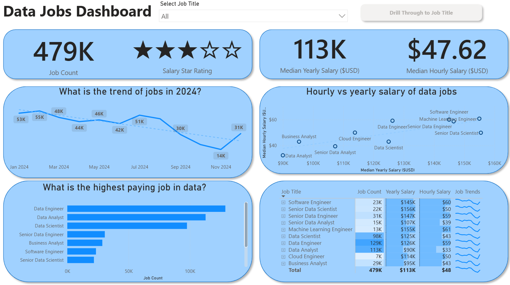
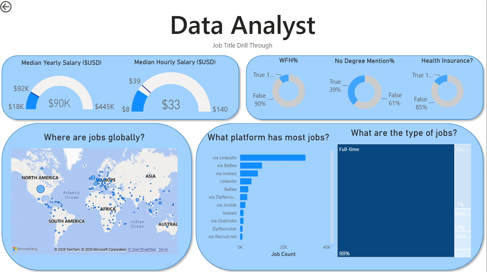

# Data Jobs Dashboard w/ Power BI

## Introduction

This dashboard was created for **Job Seekers, Job Transitioners, and Job Swappers** to solve a common problem: information about the data job market is scattered and hard to grasp. Using a real-world dataset of 2024 data science job postings (including titles, salaries, and locations), this project provides a single, easy-to-use interface to explore market trends and compensation.

### Dashboard File
You can find the file for the dashboard here: [`Data_jobs_dashboard.pbix`](Data_jobs_dashboard.pbix).  

## Skills Showcased

This project was a journey through key Power BI features. Here's a look at what we mastered:

-   **⚙️ Data Transformation (ETL) with Power Query:** Cleaned, shaped, and prepared the raw data for analysis by handling blanks, changing data types, and creating new columns.
-   **🧮 Implicit Measures:** Formulated measures to derive key insights and KPIs like `Median Yearly Salary` and `Job Count`.
-   **📊 Core Charts:** Utilized **Column, Bar, Line,** and **Area Charts** to compare job counts and track trends over time.
-   **🗺️ Geospatial Analysis:** Leveraged **Map Charts** to visualize the global distribution of jobs.
-   **🔢 KPI Indicators & Tables:** Used **Cards** to display key metrics and **Tables** to provide granular, sortable data.
-   **🎨 Dashboard Design:** Designed an intuitive and visually appealing layout, exploring both common and uncommon chart types to best tell the data story.
-   **🖱️ Interactive Reporting:**
    -   **Slicers:** To dynamically filter the report by Job Title.
    -   **Buttons & Bookmarks:** To create a seamless navigation experience.
    -   **Drill-Through:** To navigate from a high-level summary to a contextual, detailed view.
---

## Dashboard Overview

*This report is split into two distinct pages to provide both a high-level summary and a detailed analysis.*

### Page 1: High-Level Market View

This is your mission control for the data job market. It showcases key KPIs like total job count, median salaries, and top job titles to give you a quick understanding of what's happening in the job market at a glance.

### Page 2: Job Title Drill Through

This is the deep-dive page. From the main dashboard, you can drill through to this view to get specific details for a single job title, including salary ranges, work-from-home stats, top hiring platforms, and a global map of job locations.

---

## Conclusion

This dashboard showcases how Power BI can transform raw job posting data into a powerful tool for career analysis. It allows users to slice, filter, and drill through data to make informed decisions about their career paths.
